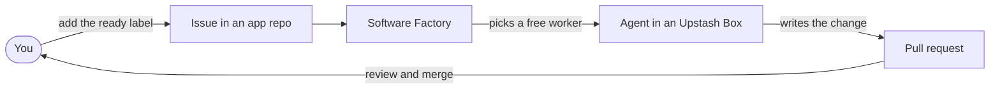
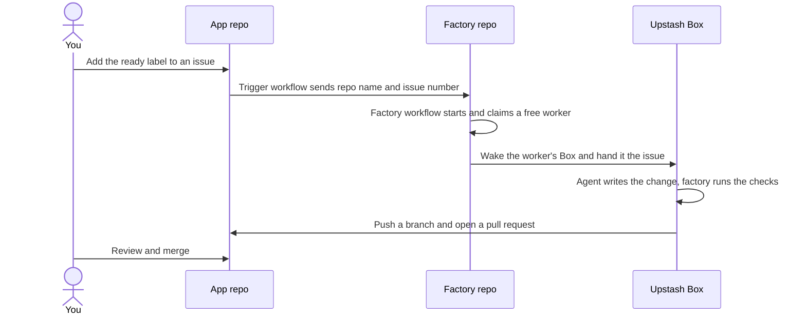

# Architecture

## Contents

- Components
- What happens for one issue
- Label states
- How a worker is claimed
- File map
- Diagrams for the README

## Components

| Part | Where it lives | Job |
|---|---|---|
| Trigger workflow | `.github/workflows/factory-ready.yml` in each app repo | On the `labeled` event, if the label is `ready` and the actor is allowed, send `repository_dispatch` (`issue-ready`, with repo and issue number) to the factory repo. |
| Factory workflow | `.github/workflows/factory.yml` in the factory repo | Receives the event, runs `src/plan.mjs` then `src/run.mjs` on a GitHub-hosted runner. One run per issue at a time. |
| Coordination code | `src/` in the factory repo | Picks and claims a worker, drives the Box, talks to GitHub. |
| Workers | Named Upstash Boxes, `<prefix><worker id>` | Where the agent runs. Paused when idle. |
| Config | `factory.config.json` | Repos, checks, workers, agent types with their Box-level model and effort settings and snapshot ids, labels, allowed actors. |

GitHub Actions cannot trigger across repos on label events. That is why each app repo needs the small trigger workflow, and why the app repo needs a secret holding a token that can write to the factory repo.

The GitHub runner does the orchestration and holds the secrets. The Box only does the work. The runner is idle most of the time, waiting on the Box. It is still held, and in private repos billed, for the whole run, including the wait for a free worker.

## What happens for one issue

1. Check the issue is open and carries `ready`. If not, stop. This is what makes a duplicate run harmless. A manual run by someone outside `allowedActors` is refused, and an `agent:` label that no enabled worker serves hands the issue back at once.
2. Claim a free worker (see below). Create its Box if missing, resume it if paused.
3. On the issue: remove `ready`, add `factory:running`, comment with the worker name and a link to the run.
4. In the Box: delete the old workspace and any saved git credentials, clone the repo with the token in the URL and git's credential helper switched off, reset the remote URL to the token-free one, create the branch `factory/issue-N`, set the git author from the config, add the repo's `exclude` patterns, run the repo's setup commands as one bash login script. A failing setup hands the issue back as a factory problem and the agent is not started.
5. Write the agent's sign-in files and its `jobFiles`, then run the agent in the background. Its prompt holds the issue's title, body and the comments people wrote, plus the factory's rules, which win over any house rules file. Poll until it exits or times out. The model and effort are already in the Box.
6. Decide:
   - agent exit code not zero: needs attention, with the log tail
   - reply starts with `NEEDS_CLARIFICATION:`: needs attention, with the question
   - a check fails: give the agent one more run with the failure output, then check again. Still failing: needs attention
   - no files changed: needs attention
7. Commit, push the branch with `--force` (a re-run replaces the old attempt), open or update the PR with `Closes #N` and the agent's summary.
8. On the issue: remove `factory:running`, add `factory:review`, comment with the PR link.
9. Always, in `finally`: delete the sign-in files, remove the busy label, pause the Box.

The agent is told not to commit, push, touch git settings or edit `.github/`. The factory does the git work so that the token is never available to the agent.

## Label states

```
(none) --user adds--> ready --factory--> factory:running --+--> factory:review ---merge PR---> closed by "Closes #N"
                        ^                                  |
                        |                                  +--> factory:needs-attention
                        +------------- user fixes the issue and re-adds ready ------------+
```

`agent:<name>` is an optional label the user adds before `ready` to force an agent type. The factory reads labels at the moment the run starts.

## How a worker is claimed

There is no database. Box labels are the shared state, because every run can read and write them through the Upstash API.

- A worker is **busy** when its Box has the `busy` label.
- Each run also adds its own label, `run-<GitHub run id>`.
- Which agent type takes an unlabelled issue: the highest `priority` with a free worker, then the smaller share of busy workers.
- Runs that start together would all pick the same worker, so the pick starts at an offset derived from the run id.
- After adding its labels, a run waits four seconds and lists the Box's labels again. If another `run-` label sorts lower than its own, it lost: it removes its own run label and tries another worker.
- A Box holds at most five labels. If adding a label fails, treat that as losing too.
- No free worker: sleep 30 seconds and look again, up to `waitForWorkerMinutes`.

Two things make this safe enough without locks: the workflow's `concurrency` group allows one run per issue, and every worker Box is created ahead of time by `provision-workers.mjs`, so runs never race to create the same Box name.

If a run is cancelled or the runner dies, `finally` does not run and the worker stays busy. `scripts/release-worker.mjs` clears it.

## File map

```
factory.config.json          everything a user edits
src/config.mjs               load and validate the config
src/workers.mjs              worker states and the pick
src/box.mjs                  sh() and runScript(), Box settings, create/claim/release a worker Box
src/agents.mjs               secrets, sign-in files, jobFiles and the agent run
src/github.mjs               issues, labels, comments, pull requests
src/plan.mjs                 dry run: what would happen for this issue
src/run.mjs                  the job, start to pull request
scripts/check-setup.mjs      tools, config, secrets, token reach, Box key. Read-only
scripts/smoke-test.mjs       one Box, one agent, "BOX OK"
scripts/install-trigger.mjs  labels and trigger PRs in the app repos
scripts/set-secrets.mjs      .env to GitHub Actions secrets
scripts/provision-workers.mjs  create missing worker Boxes, paused
scripts/build-snapshot.mjs   build a worker image (per agent type, or --shared)
scripts/apply-box-settings.mjs  write changed model and effort settings into existing Boxes
scripts/status.mjs           who is free, who is busy
scripts/release-worker.mjs   free a stuck worker
scripts/delete-workers.mjs   delete worker Boxes (user runs this)
scripts/box-exec.mjs         run one command in a worker's Box
scripts/list-boxes.mjs       every Box on the account
scripts/create-demo-issues.mjs  test issues, unlabelled by default
templates/factory-ready.yml  trigger workflow with placeholders
worker/setup.sh              what goes into the worker image
```

## Diagrams for the README

Mermaid renders on GitHub. In a `sequenceDiagram`, do not name a participant `Box`, `box` is a reserved word and the diagram fails to parse. Use an id like `Worker` with the display name you want.




